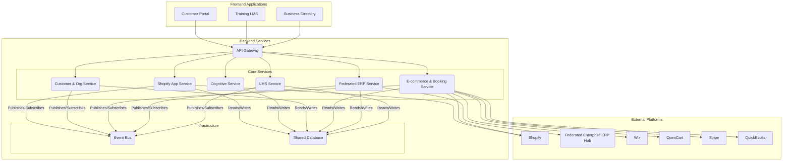

# SkinTwin Ecosystem: High-Level Backend Architecture

## 1. Introduction

This document presents a high-level backend architecture for the SkinTwin ecosystem, designed to integrate the various repositories into a cohesive, scalable, and maintainable platform. The proposed architecture is based on a microservices paradigm, which promotes modularity, independent development, and technology diversity.

## 2. Architectural Principles

The design of the backend architecture is guided by the following principles:

- **Domain-Driven Design (DDD)**: Services are organized around business domains, such as cognitive services, customer management, and e-commerce.
- **Loose Coupling**: Services communicate through well-defined APIs and an event bus, minimizing direct dependencies.
- **Scalability**: Each service can be scaled independently based on its specific load and performance requirements.
- **Technology Heterogeneity**: Each service can be implemented using the most appropriate technology stack for its domain.
- **Single Responsibility Principle**: Each service has a clear and focused responsibility.

## 3. Microservices Overview

The backend will be composed of the following core microservices:

| Service | Domain | Responsibility | Technology Stack |
|---|---|---|---|
| **Shopify App Service** | Commerce Runtime | Hosts embedded Shopify Admin app capabilities, app proxy endpoints, webhook handlers, and Shopify auth/session lifecycle. | Node.js, TypeScript, Shopify App Bridge, Shopify Admin API |
| **Cognitive Service** | AI/ML | Provides AI-powered skin analysis, personalization, and recommendations. | Python, FastAPI, JAX, OpenCog |
| **Customer & Org Service** | User Management | Manages users, organizations, tenants, authentication, and authorization. | Node.js, TypeScript, Express.js, Drizzle ORM |
| **E-commerce & Booking Service** | Integrations | Connects to external e-commerce and booking platforms. | Python, Flask |
| **Federated ERP Service** | Enterprise Data Federation | Coordinates enterprise-wide ERP federation across subsidiaries/business units for inventory, pricing, procurement, fulfillment, and financial postings. | Python/Node.js, REST/GraphQL adapters, Event-driven sync |
| **LMS Service** | Education | Manages learning content, user progress, and certifications. | Node.js, TypeScript, Express.js, Drizzle ORM |
| **API Gateway** | API Management | Single entry point for all frontend applications, handles routing and authentication. | Kong / Custom (Node.js) |
| **Event Bus** | Communication | Facilitates asynchronous, event-driven communication between services. | RabbitMQ / Kafka |

## 4. Architectural Diagram

## 5. Service Details

### 5.1. Cognitive Service

This service encapsulates the AI/ML capabilities from the `skintwin-asi` and `multiskin` repositories. It will expose a set of endpoints for:

- **Skin Analysis**: Accepting skin images or data and returning a detailed analysis of skin concerns, type, and health.
- **Product Recommendation**: Suggesting products based on skin analysis and user profile.
- **Personalization**: Providing personalized content and learning paths.

### 5.2. Customer & Organization Service

This service is the heart of the user management system, based on `skintwin-customer-portal`. It will manage:

- **Users**: Retail customers, therapists, salon owners, and administrators.
- **Organizations**: Salons, clinics, and other business entities.
- **Tenants**: Providing data isolation for different organizations.
- **Authentication**: Handling user login, registration, and session management via WorkOS SSO.
- **Authorization**: Implementing role-based access control (RBAC).

### 5.3. Shopify App Service

This service is the primary runtime of the ecosystem and makes the platform deployable as a Shopify app. It is responsible for:

- **Embedded App UX**: Rendering merchant-facing admin experiences with Shopify App Bridge.
- **App Authentication**: Managing OAuth install flow, session tokens, and shop-level tenancy context.
- **Webhooks/App Proxies**: Handling product/order/customer lifecycle events and storefront proxy requests.
- **Service Orchestration**: Delegating business capabilities to internal services through the API Gateway.

### 5.4. E-commerce & Booking Service

This service, derived from `skintwin-integrations`, will act as a facade for all external e-commerce and booking platforms. It will provide a unified API to:

- **Manage Products**: Synchronize product catalogs with Shopify and OpenCart.
- **Manage Orders**: Create and track orders from all platforms.
- **Manage Bookings**: Synchronize appointments with Wix Bookings.
- **Process Payments**: Integrate with Stripe and PayStack.

### 5.5. Federated ERP Service

This service enables enterprise-wide ERP federation without requiring a single monolithic ERP. It will:

- **Federate Domains**: Bridge multiple ERP domains (inventory, procurement, finance, fulfillment) across business units.
- **Canonical Mapping**: Translate Shopify and internal events into canonical enterprise entities.
- **Bidirectional Sync**: Support inbound ERP master data updates and outbound transactional posting.
- **Resilience Controls**: Apply idempotency keys, replay queues, and conflict resolution policies.

### 5.6. LMS Service

Based on `regima-training-lms`, this service will provide a complete learning management solution, including:

- **Course Management**: Creating and managing courses, modules, and lessons.
- **User Progress**: Tracking user progress and quiz results.
- **Certification**: Generating and managing certificates.
- **LMS Standards**: Supporting xAPI, SCORM, and LTI for integration with other LMS platforms.

## 6. Data Management

A shared PostgreSQL database will be used to store common data entities. Each service will have its own schema within the database to maintain a high degree of decoupling. Drizzle ORM will be used as the primary data access layer.

## 7. Communication

- **Synchronous Communication**: The API Gateway will handle all synchronous, request/response communication from the frontend applications to the backend services.
- **Asynchronous Communication**: The Event Bus (RabbitMQ or Kafka) will be used for asynchronous, event-driven communication between services. This will be used for tasks such as sending notifications, updating search indexes, and synchronizing data between services in a non-blocking manner.
