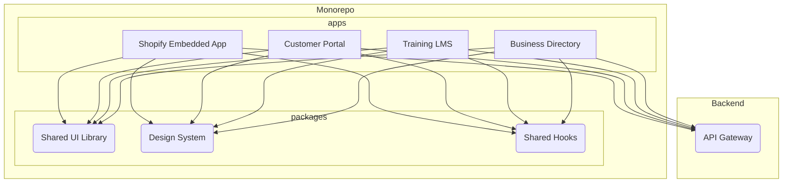

# SkinTwin Ecosystem: High-Level Frontend Architecture

## 1. Introduction

This document outlines the high-level frontend architecture for the SkinTwin ecosystem. The goal is to create a consistent, maintainable, and scalable frontend layer that provides a unified user experience across all applications. The architecture is based on a monorepo structure, a shared component library, and a consistent design system.

## 2. Architectural Principles

The frontend architecture is guided by the following principles:

- **Component-Based Architecture**: UIs are built from a set of reusable, independent, and encapsulated components.
- **Monorepo**: All frontend applications and shared libraries are managed within a single repository to streamline dependency management and code sharing.
- **Design System Consistency**: A single design system is used across all applications to ensure a consistent look and feel.
- **Separation of Concerns**: Application logic, UI components, and state management are kept separate and modular.
- **Performance**: Applications are optimized for fast loading and a smooth user experience.

## 3. Frontend Applications

The ecosystem will consist of four primary frontend applications:

| Application | Description | Key Features |
|---|---|---|
| **Shopify Embedded App** | Merchant-facing Shopify app surface for the ecosystem. | Embedded admin UX, app onboarding, webhook/event status, ERP sync controls. |
| **Customer Portal** | The main business management application for salons, therapists, and customers. | Dashboards, booking management, e-commerce, reporting. |
| **Training LMS** | The learning management system for skincare professionals. | Course delivery, quizzes, progress tracking, certification. |
| **Business Directory** | A public-facing directory of salons and therapists. | Search, filtering, maps, business profiles. |

## 4. Technology Stack

The following technology stack is recommended for all frontend applications:

- **Framework**: React 19 with TypeScript
- **Build Tool**: Vite
- **Styling**: Tailwind CSS 4
- **Component Library**: shadcn/ui
- **State Management**: Redux Toolkit / Zustand
- **Routing**: React Router
- **Data Fetching**: React Query

## 5. Monorepo Structure

A pnpm monorepo will be used to manage the frontend codebase. This structure will facilitate code sharing and simplify dependency management.

```
/apps
  /shopify-app
  /customer-portal
  /training-lms
  /business-directory
/packages
  /ui
  /design-system
  /shared-hooks
  /eslint-config
  /tsconfig
```

- **apps**: Contains the individual frontend applications.
- **packages**: Contains shared libraries and configurations.
  - `ui`: The shared component library, based on shadcn/ui.
  - `design-system`: The design tokens (colors, typography, spacing) for the Dark Atlas theme.
  - `shared-hooks`: Reusable React hooks for data fetching, authentication, etc.
  - `eslint-config`: Shared ESLint configuration.
  - `tsconfig`: Shared TypeScript configuration.

## 6. Shared Component Library

A shared component library (`/packages/ui`) will be created to ensure UI consistency and reduce code duplication. This library will be built on top of shadcn/ui and will contain both atomic components (buttons, inputs, cards) and composite components (forms, tables, modals).

## 7. Design System: Dark Atlas

The **Dark Atlas** design system, as defined in the `business-directory-template`, will be adopted across all applications. This will ensure a consistent and professional user experience.

- **Primary Color**: Electric Cyan (`#00E5CC`)
- **Accent Color**: Amber Gold (`#F5A623`)
- **Background**: Deep Slate (`#0F1419`)
- **Typography**: Outfit (headings) + Inter (body)

## 8. Architectural Diagram



## 9. State Management

- **Local State**: React hooks (`useState`, `useReducer`) will be used for managing component-level state.
- **Global State**: For cross-application state (e.g., user authentication), a global state management library like Redux Toolkit or Zustand will be used.
- **Server State**: React Query will be used to manage server state, including caching, refetching, and optimistic updates.
