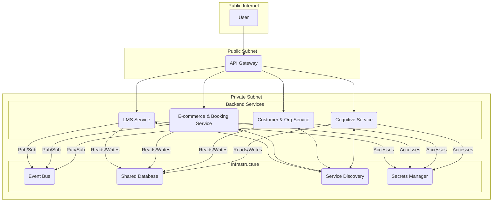

# SkinTwin Ecosystem: Network Layer and API Gateway Architecture

## 1. Introduction

This document details the network layer and API gateway architecture for the SkinTwin ecosystem. The design focuses on creating a secure, resilient, and scalable network infrastructure that supports the microservices-based backend and provides a unified entry point for all frontend applications.

## 2. Network Topology

The network will be divided into a public and a private subnet to ensure a secure and controlled environment.

- **Public Subnet**: This subnet will contain the API Gateway, which is the only component directly exposed to the public internet. All incoming traffic from frontend applications will be routed through the API Gateway.
- **Private Subnet**: This subnet will host all the backend microservices and the shared database. Services in the private subnet are not directly accessible from the internet and can only communicate with each other and the API Gateway.

## 3. API Gateway

The API Gateway is a critical component of the architecture, serving as the single entry point for all client requests. It will be responsible for:

- **Request Routing**: Routing incoming requests to the appropriate backend service based on the request path.
- **Authentication and Authorization**: Verifying the identity of the user and ensuring they have the necessary permissions to access the requested resource. This will be done by validating JWTs issued by the Customer & Org Service.
- **Rate Limiting**: Protecting the backend services from being overwhelmed by too many requests.
- **Request/Response Transformation**: Transforming requests and responses as needed to match the requirements of the backend services and frontend applications.
- **Logging and Monitoring**: Logging all requests and responses for monitoring, auditing, and debugging purposes.
- **SSL Termination**: Terminating SSL connections and encrypting traffic to the backend services.

For Shopify deployment, the gateway also fronts:
- **Shopify App Endpoints**: OAuth install/callback, embedded app session verification, and App Bridge token exchange.
- **Webhook Ingress**: Verified Shopify webhook intake endpoints with signature validation and async queue handoff.
- **App Proxy Routes**: Controlled storefront extension endpoints exposed through Shopify app proxies.

## 4. Service-to-Service Communication

Communication between services within the private subnet will be handled through a combination of synchronous and asynchronous mechanisms.

- **Synchronous Communication**: For direct, request/response style communication, services will communicate with each other via their internal REST or gRPC APIs.
- **Asynchronous Communication**: For event-driven communication, services will use the Event Bus (RabbitMQ or Kafka) to publish and subscribe to events.

Federated ERP connectors consume and emit these events to synchronize enterprise-wide data domains (catalog, inventory, order, procurement, and finance) across multiple ERP systems.

## 5. Service Discovery

To enable services to find and communicate with each other dynamically, a service discovery mechanism will be implemented. This can be achieved using a tool like Consul or etcd, or by leveraging the built-in service discovery features of a container orchestration platform like Kubernetes.

## 6. Security

Security is a top priority in the network architecture. The following measures will be implemented:

- **TLS Encryption**: All communication between the frontend applications and the API Gateway, as well as between the API Gateway and the backend services, will be encrypted using TLS.
- **Firewalls and Network Policies**: Network policies will be used to restrict traffic between services, ensuring that services can only communicate with other services they are authorized to interact with.
- **Secrets Management**: All sensitive information, such as API keys and database credentials, will be stored securely in a secrets management tool like HashiCorp Vault.

## 7. Architectural Diagram

